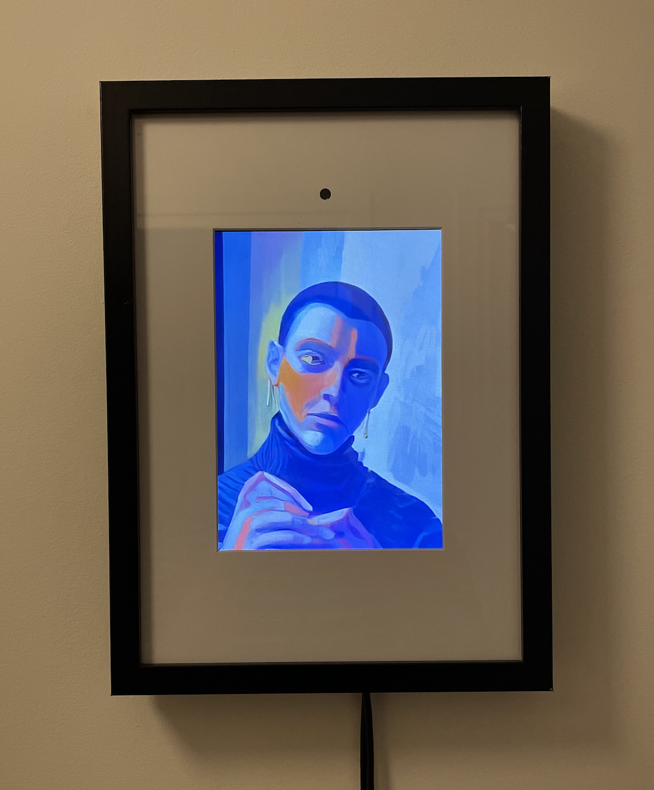

# Pablonet

<div class="image-container" style="flex: 1; text-align: left">
    
</div>

Blogpost: https://mlecauchois.github.io/posts/pablonet/

## Setup

```
python3.10 -m venv .env
source .env/bin/activate
pip install torch==2.1.0 torchvision==0.16.0 xformers --index-url https://download.pytorch.org/whl/cu121
pip install -r requirements.txt
python -m streamdiffusion.tools.install-tensorrt
pip install polygraphy==0.47.1 --extra-index-url https://pypi.ngc.nvidia.com
pip install onnx-graphsurgeon==0.3.26 --extra-index-url https://pypi.ngc.nvidia.com
```

## Run

Server CLI:
```
python server.py --base_model_path "Lykon/DreamShaper" \
--acceleration "tensorrt" \
--prompt "" \
--num_inference_steps 30 \
--guidance_scale 1.0 \
--t_index_list "[14,18]" \
--preprocessing canny_blur_shift \
--compression 80 \
--port 6000
```

Raspberry Pi client CLI:
```
python client_pi.py --prompt "painting in the style of pablo picasso, cubism, sharp high quality painting, oil painting, mute colors red yellow orange, background of green, color explosion, abstract surrealism" \
--image_size 150 \
--url ws://YOUR_URL_HERE \
--fullscreen \
--crop_size 900 \
--crop_offset_y 40 \
--compression 60
```


> Nice! I peeked at the code and thought I’d share a few tips for improving the low frame rate:
> Base64 encoding the JPEG bytes will increase payload size up to ~30% and burns CPU cycles on both client and server. This is unnecessary, as Websocket protocol can send binary payloads (doesn’t need to be text).
> Consider removing lossy jpg compression as well, ie just send the raw RGB bytes over the network. Then on the server side you can simply call Image.frombuffer(…).
> StreamDiffusion can achieve high frame rates because of extensive batching in the pipeline. You’re not benefiting from that here as the client is only sending one frame at a time and then waiting for a response. See this example for an idea of how to queue input frames and consume them in batches https://github.com/cumulo-autumn/StreamDiffusion/blob/main/e... .
> Alternatively you could take a look at the SDXL Turbo and Lightning models. They are very fast at img2img but have limited resolution of 512² or 1024² pixels respectively. Which appears a bit lower than what you’re aiming for here, but they can be run locally in real time on a high end consumer grade GPU. For reference I have some code demonstrating this here https://github.com/GradientSurfer/Draw2Img/tree/main

